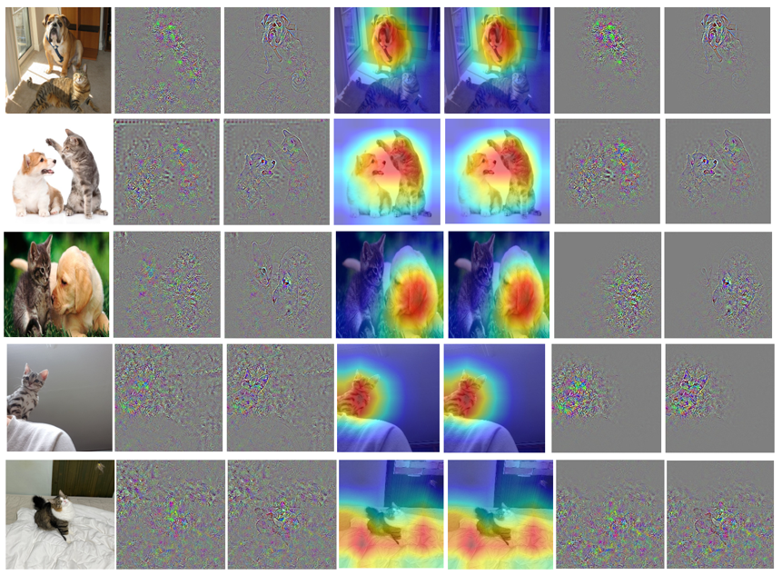

# Review of XAIs

> 컴퓨터공학과 17101227 이수아
>
> [2021-2 Open Source Software] Final Project

 

#### 1. XAI란?, 프로젝트 제안 배경

​	**설명가능한 인공지능(XAI, eXplainable AI)**란, AI 모델이 내린 결정이나 판단에 대한 이유를 사람이 이해할 수 있는 방식으로 제시하는인공지능이다. Tabular data, Image data, Text data등 각각의 데이터에 맞는 알고리즘으로 모델의 판단 과정을 분석한다.

​	Tabular data에서는 대표적으로 Shap, LIME 등의 알고리즘을 사용할 수 있고, 모델의 prediction에 각 feature들이 미치는 영향을 분석하는 방법이 일반적이다. Image data에서는 input image의 각 pixel이 모델의 prediction에 영향을 미치는 방법을 분석하는 것이 대표적이지만, CNN의 layer마다 또는 모델마다 분석할 수 있는 방법이 다양하다. Text data에서도 마찬가지로 각각의 word또는 정해진 feature들이 미치는 영향들을 분석한다.

​	이 중에서 **Image data의 XAI** 방법에 관심이 있어서 지난 1년간 스터디를 진행했었는데, 여러 서적 자료와 논문 자료를 읽으면서 공부한 후에 직접적으로 구현을 통해 분석해본 경험이 없어서 항상 아쉬움이 남아있었다. 그래서 **이번 기회를 통해서 여러 CNN 모델들을 다양한 XAI 알고리즘들로 직접 확인하여 분석해보고 비교해보는 시간을 가져보려고 한다.**

 

#### 2. 프로젝트 소개

​	XAI는 현재 분석 결과에 대한 performance를 측정할 수 있는 metrics가 없어서 자유롭게 분석을 하고 정리해보려고 한다. 최대한 다양한 image class들을 포함하고 있는 dataset으로 모델을 학습시킨 후, 선정한 XAI 기법의 결과를 확인하고 **"모델이 왜 그런 prediction을 내었는지"** 한 번 자유로운 분석을 정리해보려고 한다. 

​	`분석해본 각각의 고찰 결과는 review/ 폴더에서 확인할 수 있다.`

 

**[선정한 XAI 기법 목록]**

* Back-propagation
* Guided Back-propagation
* CAM (Class Activation Maps)
* Grad-CAM 
* Back-propagation + Grad-CAM
* Guided Back-propagation + Grad-CAM

 

**[선정한 CNN(Classification) 모델 목록]**

* VGG-19
* ResNet18
* ResNet34

(모든 모델은 ImageNet으로 pretrained)

 

#### 3. 관련 논문 정리했던 자료

​	실제 코드 구현, 고찰을 하기 전에, 이전에 XAI 스터디를 하면서 논문을 읽고 정리했던 자료를 다시 훑어보고 복습하였다. 이 중에서 이번에 구현해보지 못한 XAI 알고리즘들은 겨울방학동안 이어서 진행해보려고 한다. 

- [CAM (Class Activation Maps)](https://hellopotatoworld.tistory.com/18?category=967465)
- [Grad-CAM](https://hellopotatoworld.tistory.com/19?category=967465)
- [TCAV (Testing with Concept Activation Vectors)](https://hellopotatoworld.tistory.com/21?category=967465)
- [LRP (Layer-wise Relevance Propagation)](https://hellopotatoworld.tistory.com/17?category=942192)

 

> #### References
>
> [1] https://dydeeplearning.tistory.com/10 
