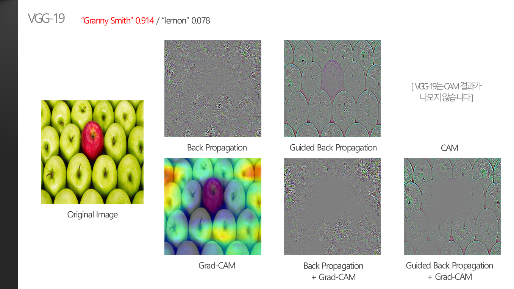
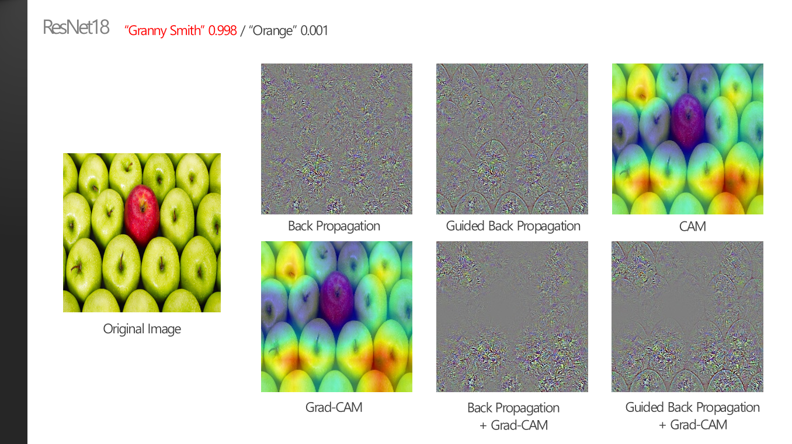
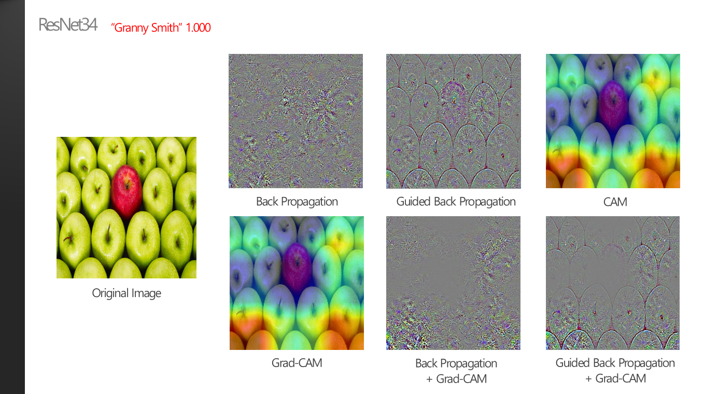

### 7. Anomaly detection을 위한 XAI?

 

> **:mag_right: What's the ​idea?**
>
>​	예전에 XAI 관련 논문을 서치해보다가, XAI를 통해 anomaly detection을 수행할 수도 있다는 연구를 보았던 기억이 있다. 앞서 "색깔"이라는 feature가 모델의 prediction의 중요한 요소였다는 결론에 접목해서, 색깔이 다른 object(anomaly)를 detection할 수 있을지 실험해보았다.
>
> 
>
>※ 명확한 metrics가 존재하지 않으므로 모든 분석은 주관적인 생각입니다.

 

* "색깔"만 다른 object라는 anomaly를 detection할 수 있을지 실험해보기 위해서, 학습되지 않은 빨간색 사과가 하나 들어있는 이미지를 선정하여 이 anomaly를 찾아내보고자 하였다.

 

* 대부분이 초록색 사과로 이루어진 이미지이기 때문에, 최종 prediction은 0.914의 probability로 매우 정확하게 예측하였다. 예측 결과와는 별개로 XAI 결과를 살펴보면, 빨간색 사과를 제외한 영역만 제대로 형태가 highlight된 것을 볼 수 있다. 빨간색 사과가 있는 부분만 흐리거나 형태를 제대로 잡지 못하고 있기 때문에, 이런 특성을 활용하면 anomaly detection을 충분히 수행할 수 있을 것이라고 기대할 수 있다.

 

* XAI의 결과에 noise가 심하게 들어가서 형태가 제대로 보이지 않는 대표적인 예시이다. 이런 경우에도 어떤 위치를 highlight할 지는 잘 찾아내기 때문에, 빨간 사과의 영역은 거의 highlight된 pixel이 없는 것을 볼 수 있다. 

 

* VGG-19와 비슷한 결과를 보이며 anomaly detection을 충분히 수행할 수 있는 결과로 보인다.

