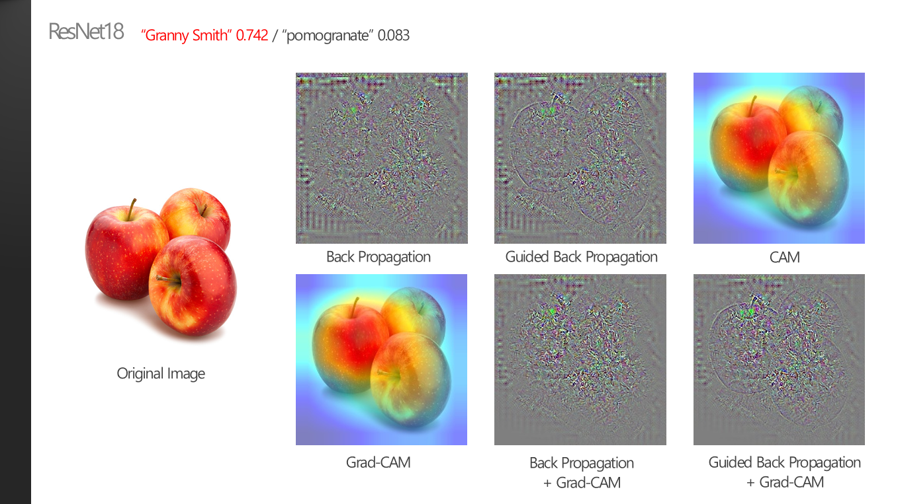

### 6. Object의 형태vs색깔?

 

> **:mag_right: What's the ​idea?**
>
>​	지금까지 XAI 결과들을 확인해보니, XAI 기법은 object의 "위치" 또는 "형태"에 민감한 알고리즘이라는 생각이 들었다. 따라서 object의 "색깔"이라는 feature에도 큰 중요도를 두는지 궁금해져서, 색깔만 다른 object의 이미지를 어떻게 구분하는지 결과를 확인해보았다.
>
> 
>
>※ 명확한 metrics가 존재하지 않으므로 모든 분석은 주관적인 생각입니다.

 

* 특정 객체의 "색깔"이라는 feature에 얼마나 큰 중요도를 두는지 확인해보기 위해서, 형태는 동일하나 색깔만 다르고 배경의 noise가 거의 없는 이미지들을 선정하였다. 색깔의 중요도에 대한 분석을 하면서 "형태"에 대한 분석도 가능하면 함께 생각해보려고 하였다.

 

* "Granny Smith"는 사과의 품종 중 하나로 대부분 초록색을 띈다. 빨간색 사과에 대한 class는 ImageNet에 들어있지 않기 때문에 분석이 용이했다.
* 초록색 사과 이미지의 경우 0.994의 높은 probability를 보인다. 빨간색 사과 이미지의 경우 probability는 0.553으로 다소 떨어지지만, 최종 prediction은 올바르게 도출하였다. 이것은 "형태"와 "색깔" 두 가지 feature를 모두 고려하여 prediction을 만들었다고 해석할 수 있다. 형태의 feature에 의존하여 Granny Smith라는 prediction을 만들었지만, 색깔의 feature가 올바르게 추출되지 않았기 때문에 probability가 다소 낮게 나온것이다.
* XAI의 결과를 확인해보면 오히려 빨간 사과의 경우가 사과의 형태를 더 명확하게 highlight한 것을 볼 수 있다. 초록 사과가 오히려 형태의 부분부분이 잘린 곳이 많지만, 훨씬 높은 정확도를 보인다. 색깔이라는 feature가 CNN의 prediction 결정 요소의 매우 중요한 부분이라고 볼 수 있다.
* 빨간 사과의 경우 두 번째로 높은 class가 "pomogranate", 즉 석류이다. 석류는 대표적으로 빨간 색상을 갖는 과일로, "색상"의 특성이 중요하게 고려됐다고 분석할 수 있는 요인 중에 하나이다.
* 사과의 예시의 경우, 아래 ResNet18과 ResNet34도 모두 같은 해석을 할 수 있는 결과를 보인다.

 

 

