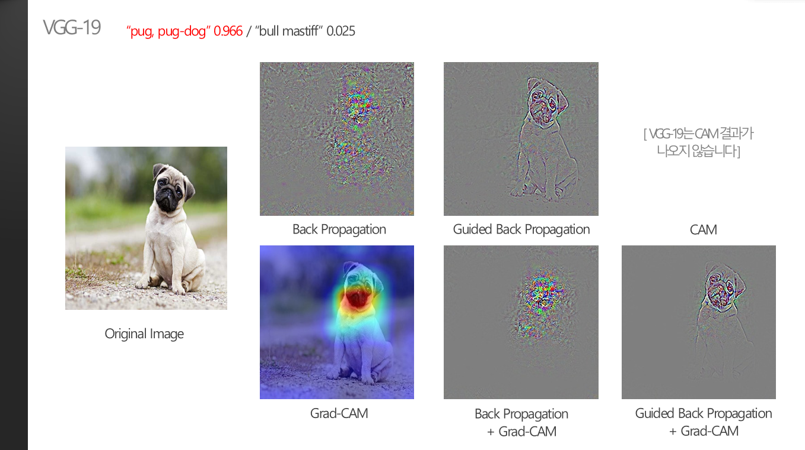
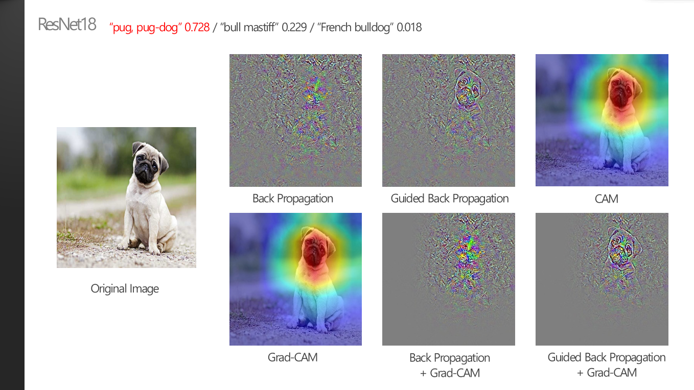

### 1. 모델의 성능에 따른 XAI 결과의 변화는?

 

> **:mag_right: What's the ​idea?**
>
>​	하나의 이미지에 대해서 CNN 모델들은 다른 prediction과 다른 확률을 보인다. 선정한 세 개의 모델이 "같은 예측"을 했지만, 예측에 대한 확률이 다를 때 XAI 결과가 어떻게 다를지 확인해보았다.
>
>
>
>※ 명확한 metrics가 존재하지 않으므로 모든 분석은 주관적인 생각입니다.

 

* 세 개의 모델이 모두 같은 예측을 하면서, 하나의 object만 포함되어 있는 이미지를 선정하여 비교해보았다.

 

* VGG-19는 최종 prediction인 pug에 대한 확률이 0.966으로 매우 높게 나왔다. XAI의 결과를 시각화해서 살펴보았을 때도, 강아지의 영역이 매우 뚜렷하게 highlight되고 배경 영역의 noise가 매우 적은 것을 볼 수 있다. 특히, pixel-based 결과들을 보면 edge를 매우 잘 찾아내어 사람의 눈으로 봐도 강아지라고 판별할 수 있을 정도라고 확인할 수 있다.
* 일부의 XAI 결과를 보면, "pug, pug-dog"라는 class를 판단하는 feature의 기준은 "강아지의 얼굴" 부위에 치우쳐있다고 할 수 있다. 실제로 사람도 여러 강아지들의 몸체는 비슷하게 헷갈릴 수 있지만, 강아지의 얼굴을 보고서 특정 종을 파악할 수 있다. 따라서 CNN 모델들도 여러 종을 구분하는 feature인 얼굴 영역을 보고 예측을 한다는 것을 알 수 있다.

 

* 앞선 VGG-19와 같은 class인 "pug"로 예측했지만, 확률이 0.729로 훨씬 낮게 나왔다.  이것을 고려하여 XAI 기법들을 확인해보면, VGG-19보다 강아지의 형체가 훨씬 덜 뚜렷하게 나타나고 배경의 noise가 심해진 것을 볼 수 있다. 마찬가지로 잇따른 두세번째 결과인 "bull mastiff"와 "french bulldog"의 확률도 훨씬 높게 나타난 것을 확인할 수 있다.
* region-based XAI인 CAM이나 Grad-CAM의 경우 확률이 낮을수록 highlight하는 영역이 훨씬 커진다고 생각할 수 있다. (예측에 확신이 클수록 highlight 영역 범위가 좁아진다.)

 

* 출력된 확률만 봐서는 VGG-19와 크게 차이나지 않는 것 같아 보이지만(0.935), XAI 결과를 보면 noise 정도나 hightlight 영역의 범위가 눈으로 비교될 정도로 차이가 나는 것을 볼 수 있다. 따라서 XAI 결과를 시각화해보는 것만으로도 더 정확한 모델을 선정할 수 있을 것으로 기대해볼 수 있다.

