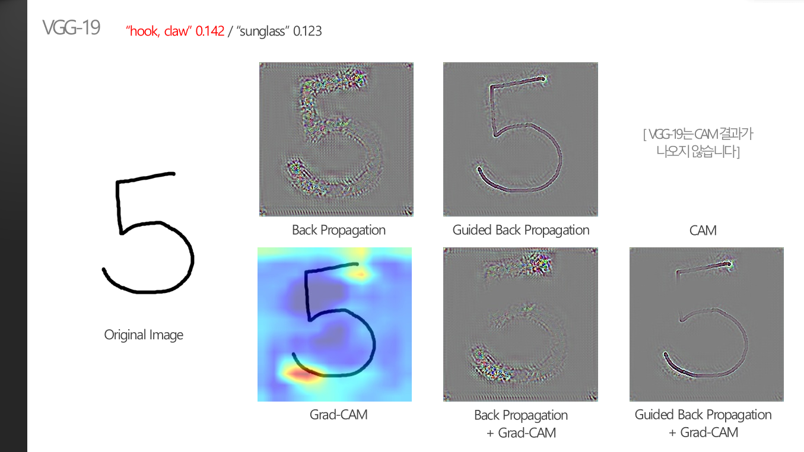
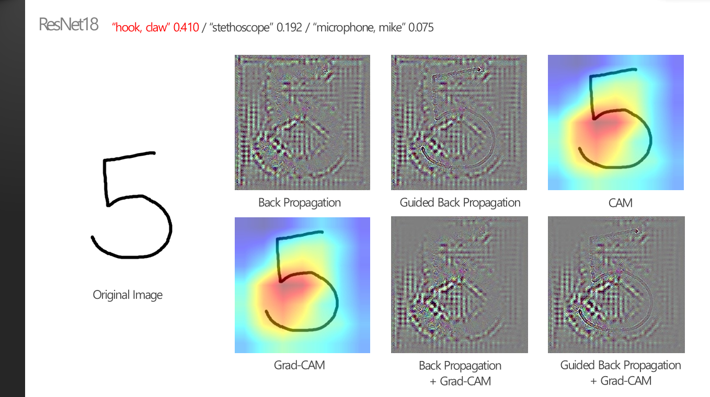
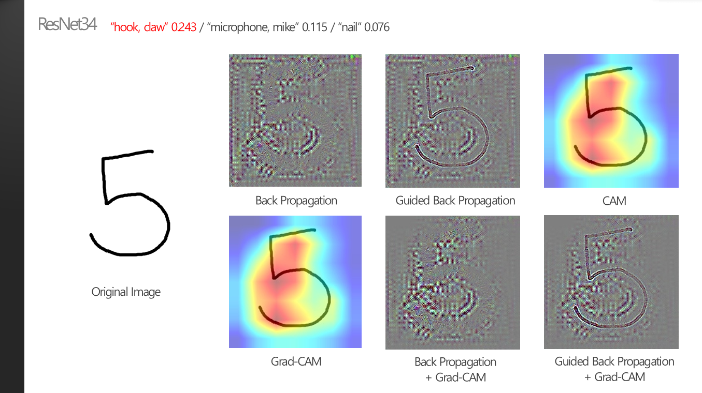

### 5. 학습되지 않은 object에 대한 결과는?

 

> **:mag_right: What's the ​idea?**
>
>​	학습되지 않은 object의 이미지가 들어오면 모델은 당연히 틀린 prediction을 만들 수밖에 없다. 하지만 결과의 정답 유무를 떠나서, 학습되지 않은 object에 대해서는 모델의 XAI 결과가 어떻게 나올지 궁금해져서 확인해보았다.
>
> 
>
>※ 명확한 metrics가 존재하지 않으므로 모든 분석은 주관적인 생각입니다.

 

* ImageNet의 class내에는 handwritten 숫자가 들어있지 않다. 따라서 눈으로 확인해볼 수 있을 정도로 최대한 단순한 feature를 갖고있는 MNIST의 숫자 5 이미지 중 하나를 사용하였다.

 

* VGG-19의 예측 결과의 확률은 0.142로 매우 낮고, 다음으로 확률이 높은 두 번째 예측과도 비슷한 수치를 보인다.
* MNIST의 숫자 5 데이터는 분명 학습되지 않아서 prediction은 틀렸지만, XAI의 결과를 확인해보면 feature는 어느정도 잘 highlight한 것을 볼 수 있다. Region-based XAI인 Grad-CAM 같은 경우에는 형태를 알아보기가 힘들지만, pixel-based XAI기법들은 각각의 pixel에서 feature를 잘 뽑아내서 사람의 눈으로 보고도 "5"라고 구분할 수 있을 정도이다.
* 따라서 CNN이 학습되지 않은 class에 대해서도 최종 prediction만 틀리게 예측할 뿐, feature extractor로써의 역할을 할 수 있기 때문에 적은 양의 데이터를 직접 확인해보기 위해서는 XAI를 사용해볼 수 있을 것 같다. 

 

* region-based XAI의 경우, ground truth와 동일한 class가 아니더라도 특정 object가 있는 위치를 잘 highlight하는 것을 볼 수 있다. class의 구분 없이 위치만 찾아내고 싶은 경우 XAI 기법을 사용해볼 수 있을거라고 기대할 수 있다.

 

