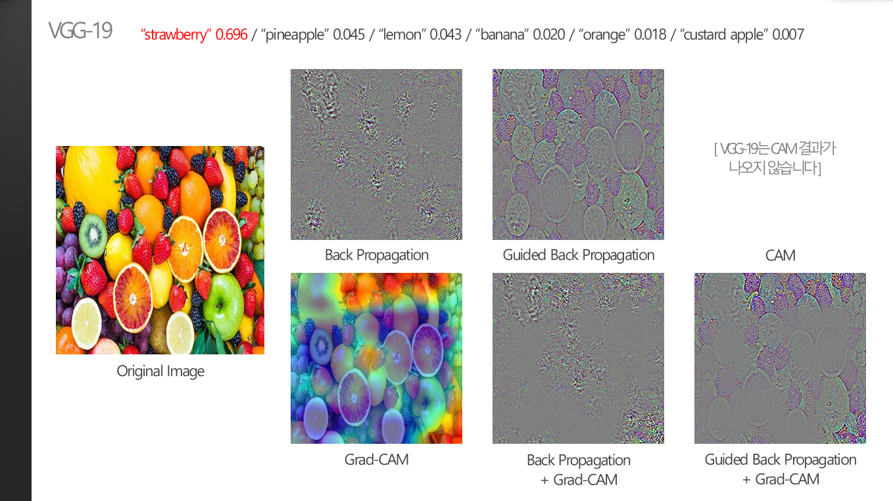
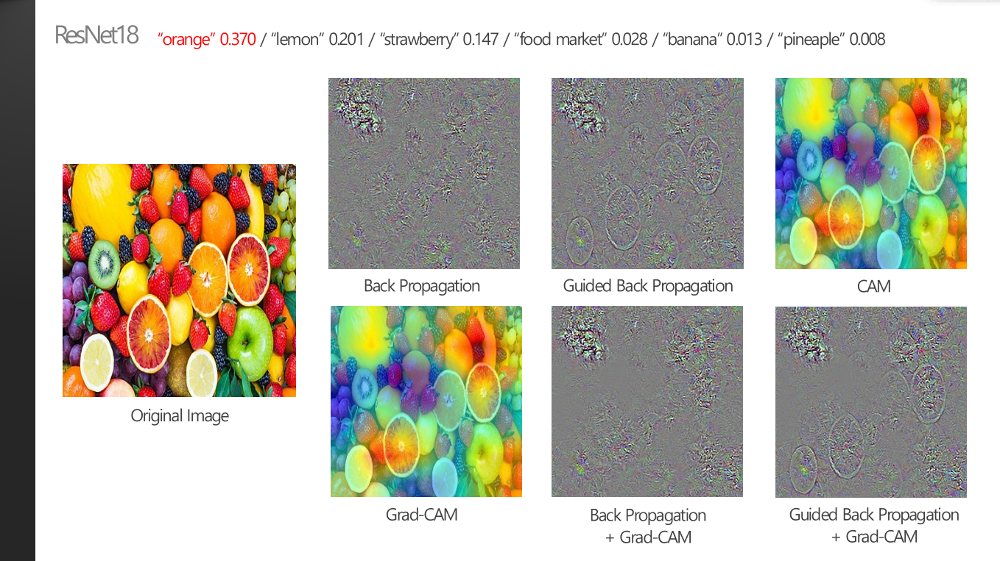
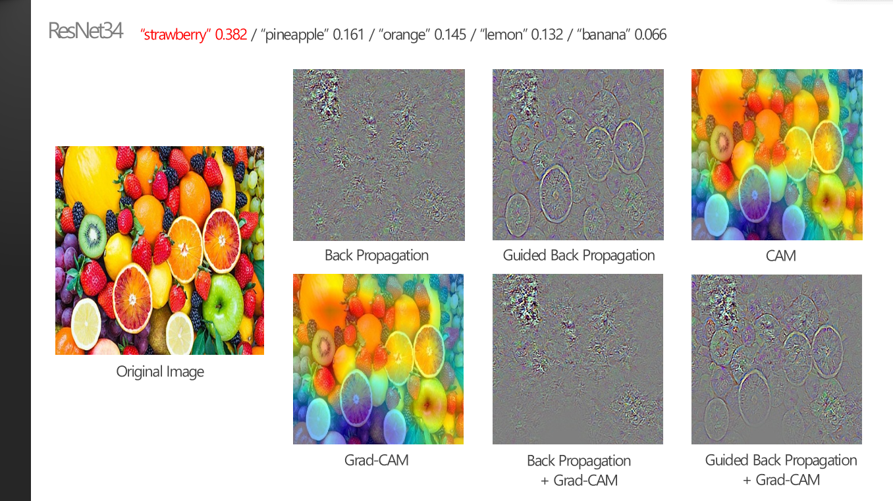

### 1. 여러 class의 object가 있을 경우에는?

 

> **:mag_right: What's the ​idea?**
>
>​	학습된 여러 class의 여러가지 object가 하나의 이미지 안에 동시에 포함되어 있어도, Classification CNN 모델은 하나의 class만 최종 prediction으로 선정해야 한다. 이럴 경우에 모델 내부에서는 어떤 object를 더 highlight하고, 최종 prediction과 heatmap의 연관성이 어떻게 나타날지 궁금해져서 확인해보았다.
>
>
>
>※ 명확한 metrics가 존재하지 않으므로 모든 분석은 주관적인 생각입니다.

 

* ImageNet에는 orange, apple, banana 등 다양한 과일의 class를 가지고 있다. 학습되어 있는 여러 가지의 class object를 동시에 가지고 있을 경우를 확인 하기 위해 다양한 과일 object를 동시에 포함하고 있는 이미지를 사용하였다.

 

* VGG-19의 최종 prediction은 "strawberry"이다. 0.696으로 꽤 확률이 높기 때문에 prediction 결과만 봤을 때에는 모델이 여러가지 과일들 중에서 strawberry의 영역만 크게 highlight했을 것이라고 예상할수도 있지만, 실제로 XAI 결과를 확인해보면 다른 모든 과일들도 어느정도 highlight한것을 볼 수 있다. 실제로 "pineapple", "lemon", "banana", "orange", "custard apple" 등 다른 과일 object들도 (낮은 확률이지만) Top-10 prediction list에 포함되어있는 것을 볼 수 있다.
* 특히 Guided Back Propation은 모든 object를 거의 동일하게 highlight한 것처럼 보인다. XAI 기법을 통해서 이 모델을 뜯어볼 때는 Guided Back Propagation은 좋은 선택이 아니였다고 생각해볼 수 있다.  
* Guided Back Propation외의 다른 XAI 기법들을 보면, "strawberry"가 있는 영역을 다른 object보다 좀 더 정확하게 highlight하고, 다른 object들은 흐린 경우가 많은 것을 볼 수 있다.

 

* 모든 XAI 기법들이 전체적으로 VGG-19보다 형체가 흐리게 highlight된 것을 볼 수 있다. 이것과 연관지어서, VGG-19의 최종 prediction인 "strawberry"는 0.696의 확률을 가지지만 ResNet18의 최종 prediction인 "orange"는 0.370로 훨씬 낮은 것을 볼 수 있다.
* 예측 결과가 다른것처럼, VGG-19의 XAI 결과들보다 strawberry가 있는 영역들을 덜 highlight한 것을 볼 수 있다.
* Back Prop+Grad-CAM 또는 Guided Back Prop+Grad-CAM의 결과를 보면, strawberry보다 orange의 영역이 더 명확하게 highlight된 것을 볼 수 있다.

 

* ResNet18과 비슷한 probability를 가지지만 최종 prediction 결과만 다르다. ResNet18의 XAI 결과들과 비교했을 때, 딸기의 영역들이 조금 더 highlight된 것을 볼 수 있다.
* VGG-19, ResNet18, ResNet34 모두 CAM이나 Grad-CAM과 같은 region-based XAI 결과만 봐서는 명확한 구분이 어렵다. 따라서 여러 object가 fruits이미지처럼 많은 수가 동시에 있는 경우에는 XAI분석의 좋은 선택이 아닐 것이라고 생각할 수 있다.

