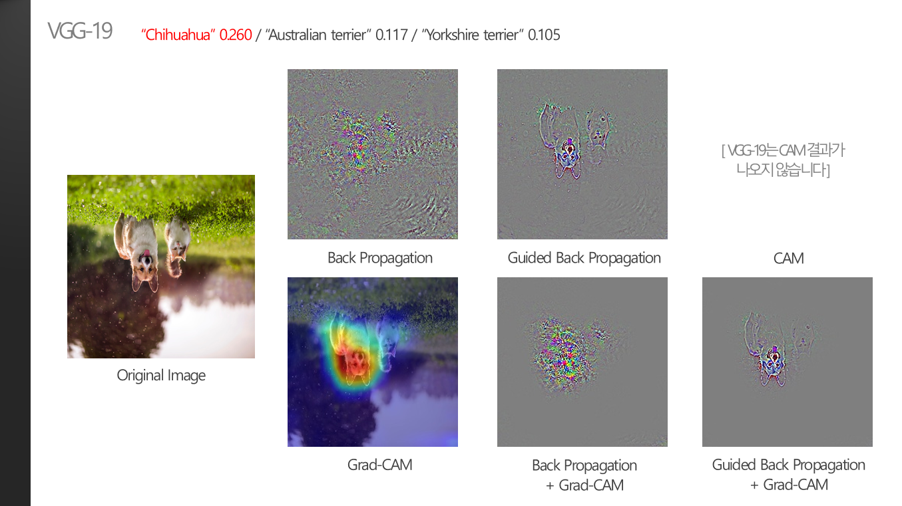
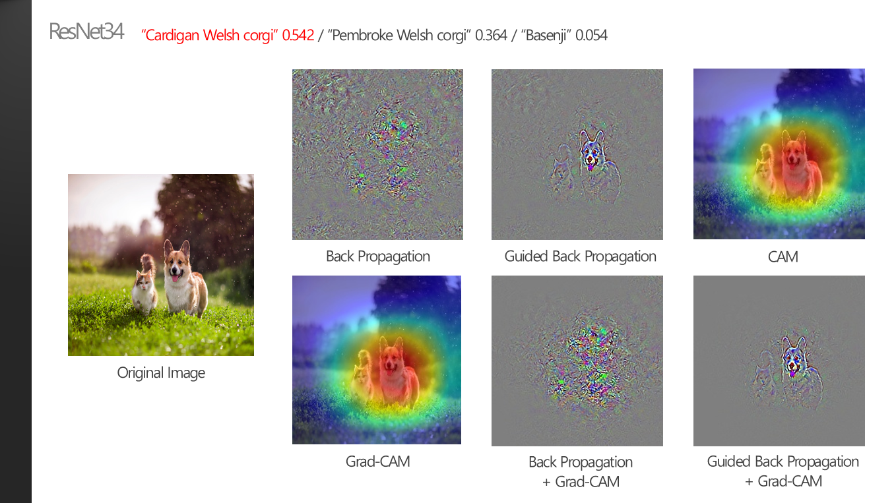

### 1. 이미지 회전에 따른 XAI 결과 변화는?

 

> **:mag_right: What's the ​idea?**
>
>​	Image data augmentation이란, 학습 데이터로 주어진 데이터들에 여러 방법으로 변화를 주어 학습데이터의 양을 늘리고 정규화의 역할을 하는 데이터 증강 기법이다. 대표적으로 rotate, shift, flip 등의 방법이 있다. 실제로 augmentation이 CNN 학습에 도움을 줄 수 있는지 살펴보기 위해 이미지를 의도적으로 180도 rotate시켜서 XAI 결과의 변화를 확인해보았다. 
>
>
>
>※ 명확한 metrics가 존재하지 않으므로 모든 분석은 주관적인 생각입니다.

 

* 이미지에 변화를 주기 위해 하나의 이미지를 CNN 모델에 그냥 넣었을 때와, 180도 회전시켰을 때의 결과를 보았다. 또, object의 위치가 prediction에 영향을 미치는지 보기 위해서(특정 방향에 있는 object가 중요도가 높게 측정되는지), 왼쪽과 오른쪽에 서로 다른 class의 object가 존재하는 이미지를 사용하였다.

 

* 이미지를 뒤집기 전에는 0.923으로 매우 높은 확률로 올바른 prediction을 도출했다. 뒤이어 예측되는 class들도 모두 강아지의 한 종류이고, XAI 결과를 확인해보아도 고양이의 영역보다는 강아지의 영역을 훨씬 highlight한 것을 볼 수 있다. pixel-based XAI의 경우 object의 형태를 좀 더 자세하게 보여주고, region-based XAI는 어떤 object에 더 집중했는지 한 눈에 보기 쉽게 영역을 표시해주기 때문에, 두 XAI 기법의 결과를 겹쳐서 시각화하면 더 확실하게 해석해낼 수 있을 것으로 기대한다.
* 이미지를 뒤집었을 때의 결과를 보아도 고양이보다 강아지의 영역이 확실하게 highlight되어있다. 이로써 object의 방향이나 위치가 해당 object의 중요도에 영향을 미치지는 않는다고 해석할 수 있다. 모델의 probability가 낮게 나온 이유는, 고양이와 강아지 둘 중 어떤 object에 더 집중해야할지 헷갈려서가 아니라, 분석하려는 "강아지" object가 어떤 종인지 구분하기 어렵기 때문이라는 것을 알아낼 수 있다.
* ImageNet의 학습 데이터 대부분이 강아지의 형태가 뒤집어지지 않은 상태로 있을 것이다. 모델이 rotated된 이미지를 받아도 XAI 결과도 동일하게 뒤집어진 형태로 나올 뿐, 대부분 noise가 추가적으로 생기지는 않기 때문에, 단순히 rotated된 이미지를 생성하여 학습 데이터를 생성하는 것이 모델 성능 향상에 큰 도움이 될 것이라는 결론을 도출할 수 있다.

 

* 애초에 원본 이미지의 prediction probability가 매우 낮게 나온 경우는 이미지에 변화를 주었을 때 noise가 매우 심해지는 것을 볼 수 있다. 단순히 "강아지"가 무슨 종인지 구분하기 어려워서 정확도가 낮아진 것이 아니라, 다른 요소들이 모델의 예측을 방해하고 있다는 것을 알 수 있다. 실제로 rotated 이미지의 경우 최종 prediction이 "bubble"로, 강아지와는 거리가 먼 결론이 도출되었다. 이런 경우에는 data augmentation을 추가해서 학습하여도 모델의 정확도가 높아질것이라고 보장할 수 없다.

 

* VGG-19와 비슷한 해석을 할 수 있는 결과를 보인다.

