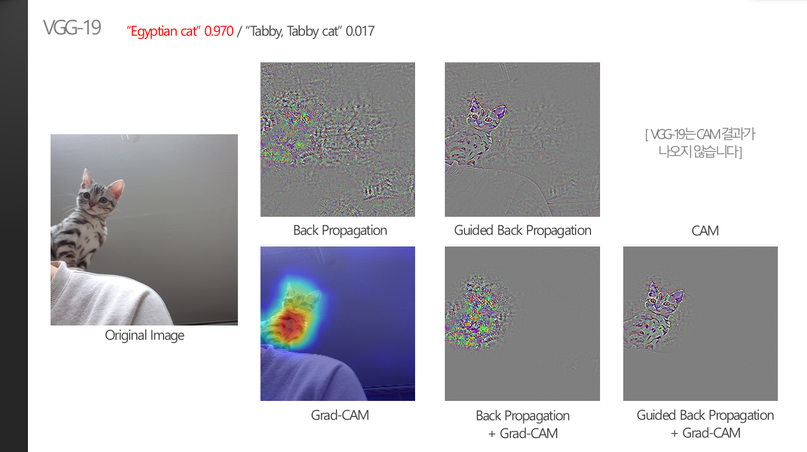
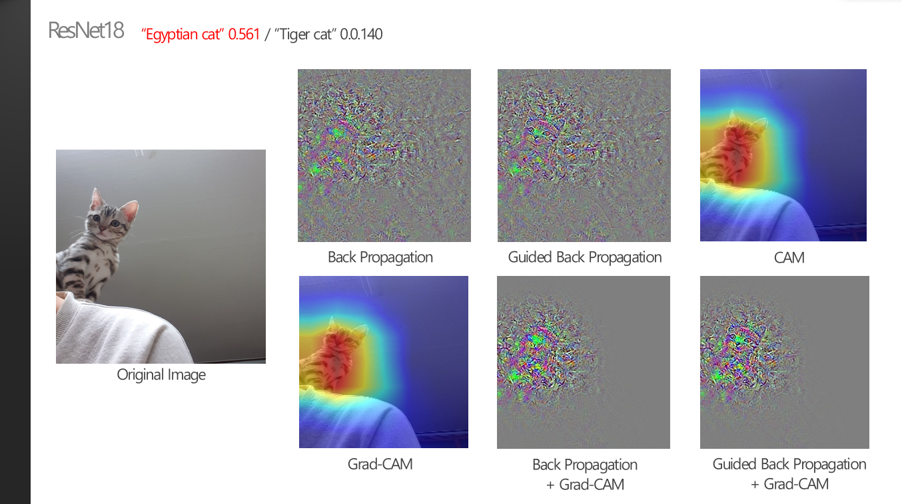
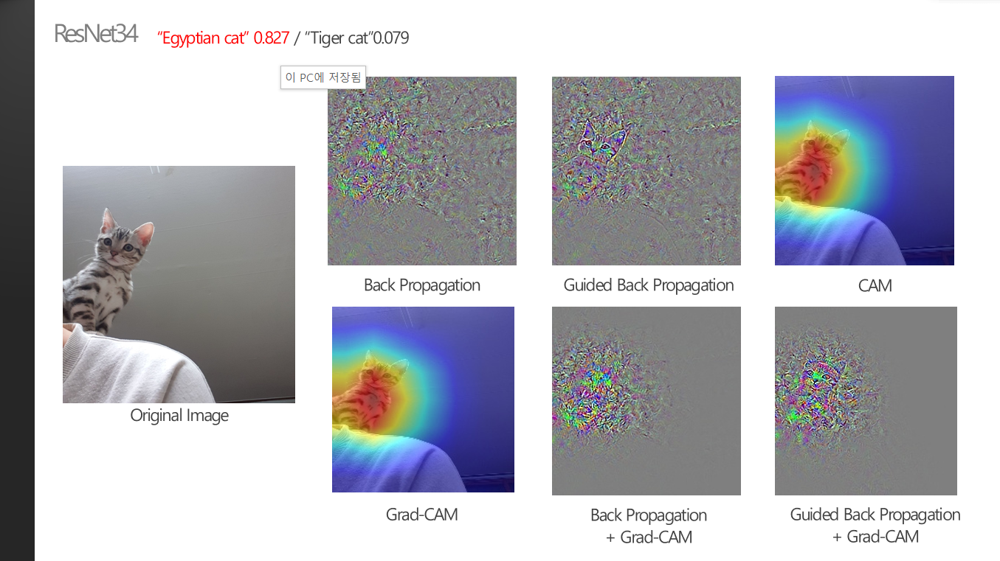

### 1. Single object의 위치가 한쪽으로 치우친 경우에는?

 

> **:mag_right: What's the ​idea?**
>
>​	single classification CNN 모델들은 translation-invariance라는 특성을 가지고 있기 때문에, object가 이미지 상의 어떤 위치에 존재하든지 같은 prediction을 출력한다. 따라서 CNN모델의 output만으로는 object들의 위치를 알아낼 수 없지만, 모델 내에서 분석하는 XAI의 결과를 확인해보면 위치를 알아낼 수도 있지 않을까? 라는 생각으로 확인해보았다. 
>
>
>
>※ 명확한 metrics가 존재하지 않으므로 모든 분석은 주관적인 생각입니다.

 

* Object가 하나만 존재하지만, 한쪽으로 치우친 경우의 XAI 결과를 확인해보기 위해서 이미지의 고양이 object가 왼쪽으로 치우쳐있는  사진을 사용하였다.

 

* VGG-19의 경우 최종 prediction(Egyptian cat)의 확률이 0.970으로 다소 높게 나왔다. 그만큼 XAI의 결과들도 배경의 잡음도 거의 없고, Object의 Edge와 feature들을 매우 뚜렷하고 보여주는 것을 확인할 수 있다. 특히 Guided Back prop + Grad-CAM같은 경우는 사람이 눈으로 확인해도 고양이라고 판별할 수 있을 정도이다.
* 그냥 Classification CNN의 prediction 결과만 확인해서는 object의 위치 정보는 파악할 수가 없다. 하지만 XAI의 결과를 확인해보니 object의 위치가 어디있는지까지 파악할 수 있음을 알 수 있다. 
* XAI 기법들 중에서는 Back Prop의 결과가 가장 안 좋게 나온 것을 볼 수 있다.

 

* VGG-19와 같은 "Egyptian cat"이라는 최종 prediction을 만들었지만, 확률이 훨씬 낫게 나왔다. XAI 기법들의 결과를 확인했을때도, VGG-19의 결과보다 훨씬 덜 뚜렷한 모습을 볼 수 있다.
* 만약 XAI의 기법을 사용해서 bounding box를 그려내고 object detection까지 수행할 수 있을까? 라고 생각해볼때는, VGG-19가 noise가 훨씬 덜 하기 때문에 prediction의 확률이 높을수록 정확한 위치 정보를 줄 것이라고 기대해볼 수 있다.

 

* VGG-19만큼은 못하지만, ResNet18보다는 정확한 결과를 보인다. prediction의 확률도 0.827정도로 중간 결과가 나온것을 볼 수 있다.

